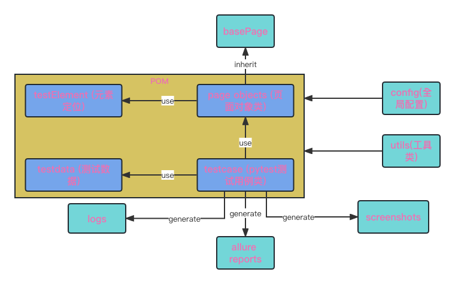

# 一款小型webUI自动化测试框架

框架基于Selenium与pytest，使用了POM设计模式和分层思想，封装了日志、配置等常用模块；采用yaml管理用例实现数据驱动；使用allure生成测试报告。

框架架构图：

#### 为什么用yaml编写测试用例？
当然也可以用Excel, json, xml等等方式，但是个人偏好用yaml, 因为和Excel的二维表相比更灵活，可以多层嵌套和定义不同数量的字段；和json, xml同样是key-value形式，但是相比之下看起来更简洁易读
